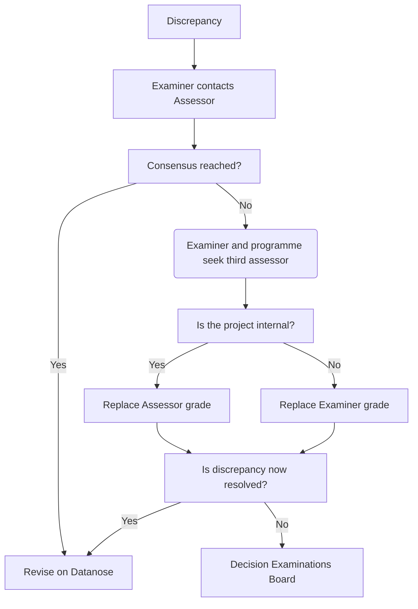

For all individual projects, assessment involves two parties: the examiner and the assessor. Their grades can differ somewhat, but if there is a discrepancy of one grade point or more, we presume there is unclarity about the grading norms.

In these cases, the examiner is requested to contact the assessor to establish why there is a discrepancy and to reach consensus about the grade. Once such consensus has been reached, the grading on the [[./Datanose project page|Datanose project page]] needs to be revised.

If consensus cannot be reached, programme and examiner will need to identify a third party for assessment. This new grade will substitute for either the examiner's grade or the assessor's grade, depending on the nature of the project. The below flowchart represents this process (capitalised roles are the roles as registered on Datanose).

If the additional assessment does not solve the problem, the issue is returned to the Examinations Board, who will decide on the course of action together with the project examiner.